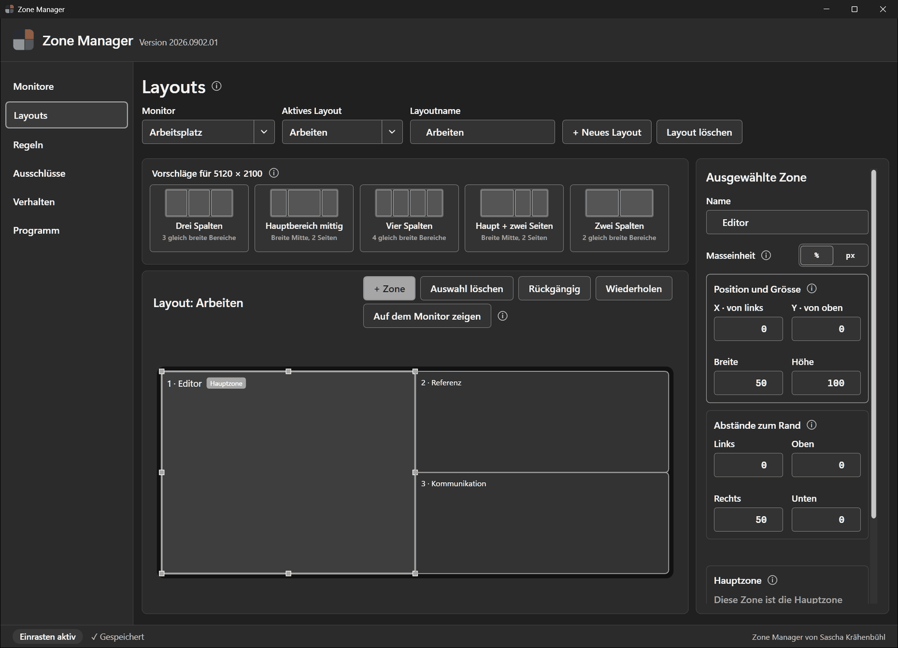
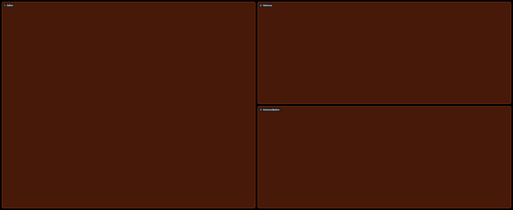
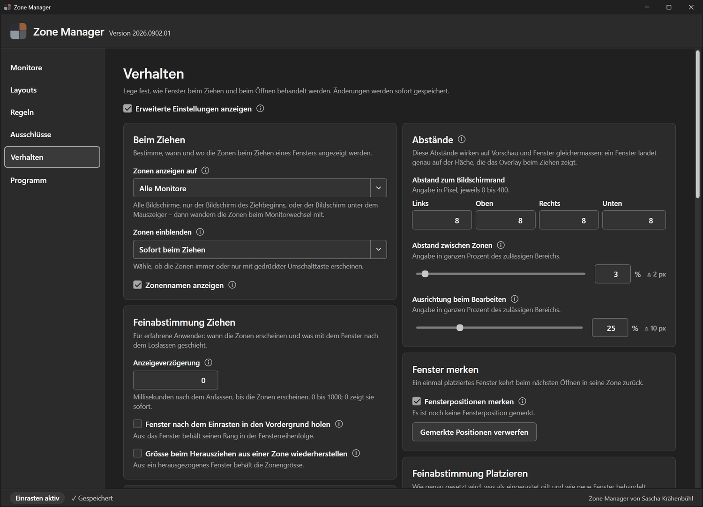
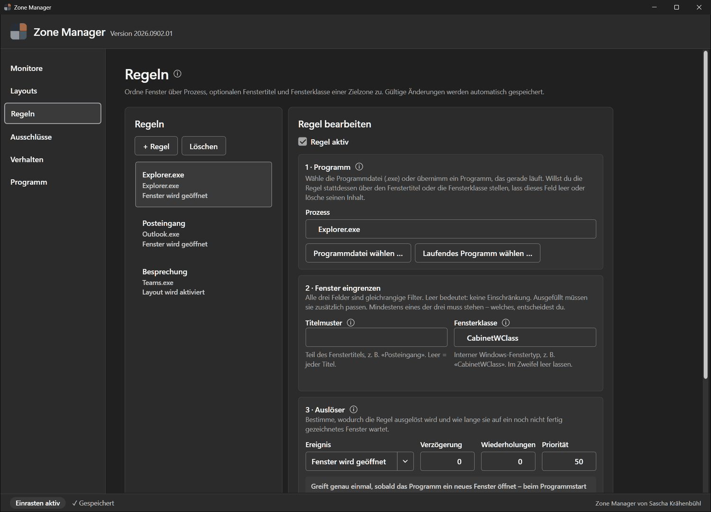
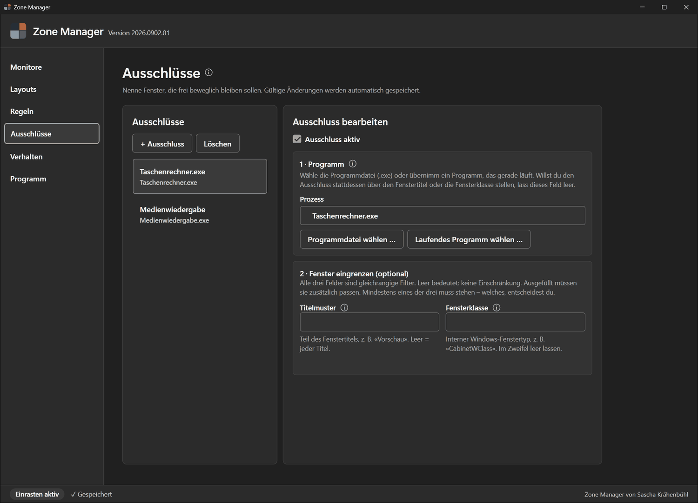
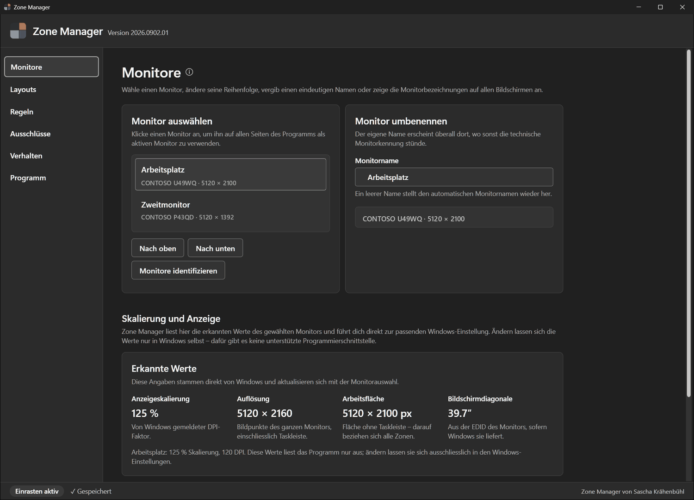
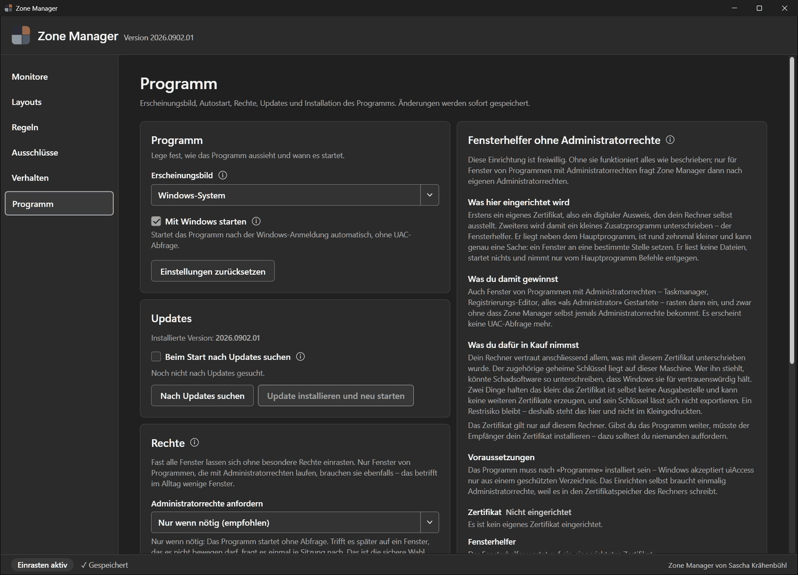

<div align="center">


# Zone Manager

**Fensterzonen für Windows 11, die du selbst zeichnest.**

Ziehe ein Fenster an der Titelleiste — der Bildschirm zeigt deine Zonen. Lass los, und das Fenster
sitzt pixelgenau darin. Kein Treiber, kein Dienst, keine Code-Injektion, keine Telemetrie.

[](https://www.microsoft.com/windows)
[](https://dotnet.microsoft.com/download/dotnet/8.0)
[](LICENSE)
[](https://github.com/klopp1991/zone-manager/releases/latest)



</div>

---

## Warum

Windows Snap kennt vier Kacheln und fragt nicht, wie du arbeitest. Ein 49-Zoll-Bildschirm braucht
andere Aufteilungen als ein Laptopdisplay, und die Aufteilung fürs Programmieren ist nicht die fürs
Recherchieren.

Zone Manager dreht das um: **du** zeichnest die Bereiche, für jeden Monitor einzeln, so viele Layouts
wie du willst — und wechselst sie in einem Klick.

## Herunterladen und starten

`ZoneManager.exe` aus dem [neuesten Release](https://github.com/klopp1991/zone-manager/releases/latest)
laden und starten. Das war's — keine Installation, keine Laufzeitumgebung, kein Setup-Assistent. Die
Datei läuft aus dem Ordner, in dem sie liegt.

Wer sie dauerhaft einrichten will, wählt **Programm → Installation** oder ruft `ZoneManager.exe --install`
auf: Das kopiert sie nach `%ProgramFiles%`, verknüpft sie im Startmenü und trägt sie in «Apps und
Features» ein — deinstallierbar wie jedes andere Programm.

---

## Was es kann

### Zonen zeichnen, nicht auswählen

Zonen entstehen mit der Maus, über acht Griffe oder über exakte Zahlen — wahlweise als Position und
Grösse oder als Abstände zu den vier Rändern, in Prozent oder Pixel. **+ Zone** füllt automatisch die
grösste freie Fläche. Zonen docken magnetisch an Kanten an (`Alt` schaltet das ab), `Strg + Z` und
`Strg + Y` nehmen jeden Schritt zurück, und fünf Vorlagen liefern in einem Klick einen Startpunkt, der
zum Seitenverhältnis des Monitors passt.

Überlappende, zu kleine oder herausragende Zonen werden markiert und lassen sich gar nicht erst
speichern. Jede gültige Änderung ist sofort gesichert — es gibt keine Speichern-Schaltfläche.

### Das Overlay beim Ziehen



Sobald du ein Fenster anfasst, erscheinen die Zonen mit Nummer und Namen. Farbe, Deckkraft,
Rahmenbreite, Eckenradius und Schriftgrösse sind einstellbar; die Zonen erscheinen wahlweise auf allen
Monitoren, nur auf dem des Ziehbeginns oder wandernd unter dem Mauszeiger mit.

Mit gedrückter **Strg**-Taste über mehrere Zonen ziehen verbindet sie: Das Fenster belegt dann ihre
gemeinsame Fläche.

Und es sitzt wirklich genau: Windows gibt Fenstern einen unsichtbaren Griffrand von einigen Pixeln, den
Zone Manager herausrechnet. Nach jedem Setzen wird nachgemessen und bei einer Abweichung von mehr als
zwei Pixeln ein zweites Mal gesetzt.

### Fenster, die sich merken, wo sie hingehören



Drei Mechanismen greifen ineinander, in dieser Reihenfolge:

1. **Regeln** — eine feste Zone für ein bestimmtes Fenster.
2. **Gemerkte Positionen** — jedes einmal platzierte Fenster kehrt beim nächsten Öffnen in seine Zone
   zurück. Auch nach einem Auflösungswechsel, dann anteilig umgerechnet.
3. **Hauptzone** — eine Zone je Layout als Arbeitszone. Dort landet, was sonst nirgends hingehört.

Wer es genauer will, blendet die **erweiterten Einstellungen** ein: Anzeigeverzögerung, Toleranzen beim
Nachmessen, Umgang mit Fenstern fester Grösse, Katalogumfang, Schutzgrenzen, Wartezeiten. Jeder Wert hat
einen sicheren Standard, einen begrenzten Bereich und eine Erklärung direkt daneben.

### Vollbild, das in der Zone bleibt

Ein Video auf Twitch oder YouTube im Vollbild nimmt sonst den ganzen Monitor. Mit **Vollbild in der Zone
halten** füllt es nur die Zone, in der sein Fenster liegt — der Rest des Bildschirms bleibt frei für alles
andere.

Der Player merkt davon nichts: er bleibt in seinem Vollbildmodus und legt Bedienelemente und Bildgrösse auf
die kleinere Fläche aus, so wie er es auf einem kleineren Bildschirm täte. Möglich ist das, weil ein Browser
im Vollbild kein Exklusivbild anfordert, sondern sein Fenster randlos über den Monitor legt — und ein Fenster
lässt sich setzen, auch gegen den Widerstand des Programms, das sich sonst auf die Monitorfläche
zurückklemmt.

Angefasst wird nur, was vorher in einer Zone lag. Ein frei abgelegtes Fenster geht weiterhin auf den ganzen
Monitor, ein Ausschluss gilt auch hier, und ein Programm, das sich wiederholt zurücksetzt, bekommt nach
einigen Versuchen seinen Willen statt in einen Dauerkampf zu geraten.

### Regeln



Eine Regel verbindet ein Fenster mit einer Zielzone — beschrieben über Programm, Fenstertitel und
Fensterklasse, einzeln oder kombiniert. Das Programm wählst du über den Dateidialog oder aus der Liste
der laufenden Programme; von dort wird bewusst nur der Dateiname übernommen, damit die Regel das nächste
Programmupdate überlebt.

Als Auslöser dienen **Fenster wird geöffnet**, **Fenster erhält den Fokus** oder **Layout wird
aktiviert**, dazu Verzögerung, Wiederholungen und Priorität. Fehlt einer Regel ihr Ziel, pausiert sie
sichtbar — es gibt keinen stillen Rückfall auf irgendetwas anderes.

### Ausschlüsse



Manche Fenster sollen einfach in Ruhe gelassen werden. Ein Ausschluss bekommt kein Overlay, rastet
nirgends ein, wird von keiner Regel bewegt und landet nicht im Positionsgedächtnis. Er ist stärker als
jede Regel.

### Monitore, die wiedererkannt werden



Monitore werden an Hersteller, Modell und Seriennummer aus der EDID wiedererkannt — steckst du denselben
Bildschirm an einen anderen Anschluss, folgen ihm Layouts, Name und Reihenfolge. Anstecken, Abstecken,
neue Auflösung, andere Skalierung oder eine verschobene Taskleiste werden im Betrieb übernommen, ohne
Neustart.

Und je Monitorkombination merkt sich das Programm, welche Layouts zuletzt aktiv waren: am Dock ein
anderes Set als unterwegs.

### Rechte: so wenig wie möglich



Windows lässt ein Programm nur Fenster verschieben, die derselben oder einer niedrigeren Vertrauensstufe
angehören. Statt sich deshalb dauerhaft Administratorrechte zu nehmen, startet Zone Manager gewöhnlich
und fragt **höchstens einmal je Sitzung** nach — und nur dann, wenn wirklich ein höher berechtigtes
Fenster im Weg war.

Wahlweise gibt es einen dritten Weg: einen winzigen, signierten Fensterhelfer mit `uiAccess`. Er kann
genau eine Sache — ein Fenster an eine Stelle setzen — liest keine Dateien, startet nichts, nimmt Befehle
nur über eine Pipe entgegen, die auf dein Konto beschränkt ist, und prüft, wer am anderen Ende sitzt.
Damit rasten auch Fenster von Programmen mit Administratorrechten ein, ohne dass Zone Manager selbst je
welche bekommt. Diese Einrichtung ist freiwillig, verlangt einmalig ein selbst ausgestelltes Zertifikat
und ist in der Oberfläche mit allen Konsequenzen beschrieben — auch mit denen, die dagegen sprechen.

---

## Tastenkürzel

| Kürzel | Wirkung |
|---|---|
| `Ctrl + Shift + ←` / `→` | Fenster eine Zone zurück oder weiter, über Monitorgrenzen hinweg |
| `Ctrl + Shift + 1` … `9` | Fenster in die Zone mit dieser Nummer |
| `Ctrl + Shift + Rücktaste` | Fenster zurück an die Stelle vor dem letzten Einrasten |
| `Ctrl + Alt + Shift + F12` | Not-Aus: Einrasten anhalten und wieder starten |
| `Strg` beim Ziehen | Mehrere Zonen zu einer Fläche verbinden |
| `Umschalt` beim Ziehen | Zonen einblenden, wenn sie nicht sofort erscheinen sollen |
| `Strg + Z` / `Strg + Y` | Im Layouteditor: zurücknehmen und wiederherstellen |

Die Zusatztasten der Zonenkürzel lassen sich auf `Ctrl + Alt`, `Alt + Shift` oder `Ctrl + Win`
umstellen, falls ein anderes Programm sie belegt. `Ctrl + Alt` ist dabei nicht zu empfehlen: Windows
erzeugt aus `AltGr` intern `Ctrl + Alt`, sodass die Zifferkürzel die AltGr-Zeichen derselben Tasten
verschlucken — auf einer Schweizer Tastatur `@`, `#` und `|`, auf einer deutschen `{`, `[` und `]`.

---

## Sicherheit und Datenschutz

- **Kein Treiber, kein Windows-Dienst, keine Code-Injektion.** Das Programm arbeitet ausschliesslich mit
  dokumentierten Windows-Schnittstellen.
- **Keine Telemetrie, kein Konto, keine Registrierung.** Die einzige Netzwerkverbindung ist die
  Updatesuche bei GitHub — sie ist ausgeschaltet, bis du sie einschaltest, und sendet nichts ausser der
  Anfrage selbst.
- **Alles bleibt lokal.** Einstellungen liegen unter `%APPDATA%\SnapZones\settings.json`, daneben die
  fünf letzten Sicherungen. Export und Import schreiben und lesen eine einzige JSON-Datei.
- **Ein Schutzschalter** hält das Einrasten an, wenn Windows ungewöhnlich viele Fensterereignisse meldet
  oder ein Rückruf fehlschlägt; die Statuszeile sagt jederzeit, woran man ist. Ein Stopp wegen blosser
  Last hebt sich nach zehn Sekunden von selbst wieder auf.
- **Updates** werden nur über HTTPS aus der Release-Ablage dieses Projekts geladen und an Herkunft,
  Grösse und SHA-256-Prüfsumme geprüft. Eine Veröffentlichung ohne Prüfsummendatei wird abgelehnt.
  Übernommen wird die neue Version erst, nachdem die laufende beendet ist; die eigene Programmdatei wird
  nie unter dem laufenden Programm ausgetauscht.
- **Die eigene Programmdatei bleibt unter Beobachtung.** Wird sie von aussen ersetzt — etwa durch einen
  Build —, speichert das Programm und startet in die neue Datei hinüber, statt beim nächsten Nachladen
  abzustürzen.

Das Programm ist **nicht** digital signiert. Windows kann deshalb beim ersten Start eine
SmartScreen-Warnung zeigen. Wem das nicht genügt, der baut es aus diesen Quellen selbst.

## Grenzen

- Nur Windows 11 x64.
- Zonen sind Rechtecke; nicht rechteckige Zonen und virtuelle Desktops gibt es nicht.
- Zwei baugleiche Monitore ohne Seriennummer in der EDID lassen sich nach einem Umstecken nicht
  auseinanderhalten.
- Das Zonen-Vollbild erreicht keine Spiele im Exklusivvollbild: diesen Bildschirmmodus vergibt der
  Grafiktreiber und nicht der Fenstermanager. Browser, Videoplayer und Spiele im randlosen Fenster
  liegen dagegen als gewöhnliches Fenster vor und lassen sich setzen.
- Eigene Zonen lassen sich nicht in das native Windows-Snap-Popup einhängen — dafür gibt es keine
  dokumentierte Schnittstelle. Zone Manager bringt sein eigenes Overlay mit.
- Die Oberfläche ist einsprachig deutsch.

---

## Selbst bauen

Voraussetzung ist das [.NET 8 SDK](https://dotnet.microsoft.com/download/dotnet/8.0).

```powershell
git clone https://github.com/klopp1991/zone-manager.git
Set-Location zone-manager
dotnet test ZoneManager.sln -c Release
dotnet build ZoneManager.sln -c Release
.\ZoneManager.exe
```

Jeder Build des App-Projekts veröffentlicht anschliessend automatisch die selbständige
`ZoneManager.exe` ins Wurzelverzeichnis; `-p:SkipRootExecutablePublish=true` überspringt diesen Schritt
für schnelle Zwischenbuilds.

Der vollständige Prüflauf `scripts\verify.ps1` baut, testet, veröffentlicht und prüft zusätzlich am
echten System, dass das Programm pro Monitor DPI-bewusst ist und der unsichtbare Fensterrand innerhalb
der angenommenen Grenzen liegt. Er braucht eine interaktive Sitzung; `-SkipDpiCheck` überspringt den
Teil, der eine UAC-Abfrage stellt.

Die Lösung ist in drei Schichten geteilt: `SnapZones.Core` (Geometrie, Modelle, Regeln, Persistenz, ohne
Windows-Abhängigkeit), `SnapZones.Windows` (alles, was Win32 anfasst) und `SnapZones.App` (WPF-Oberfläche
und Ablaufsteuerung). Die Testsuite unter `tests\SnapZones.Tests` deckt Kernlogik und Oberfläche ab.

**Weiterführend:** [Bedienung und Architektur](docs/README.md) · [UI-Richtlinien](docs/ui-richtlinien.md)

## Mitwirken

Fehlerberichte und Vorschläge sind willkommen. Änderungen bitte mit passenden Tests einreichen; vor einem
Commit sollte `dotnet test ZoneManager.sln -c Release` grün sein.

## Lizenz

[MIT](LICENSE) · © 2026 Sascha Krähenbühl
